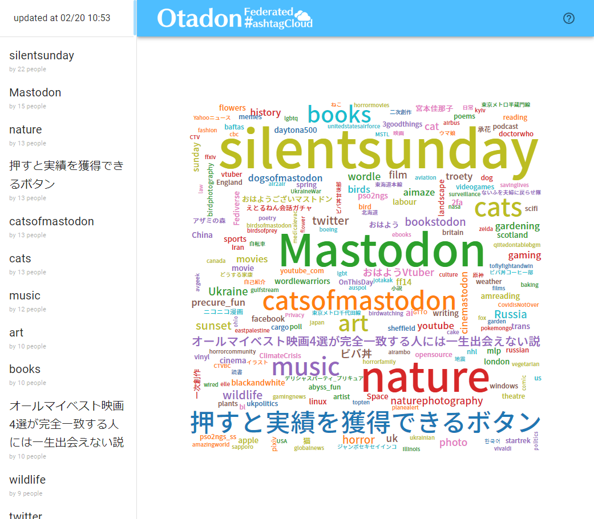

# Otadon Federated Hashtag Cloud

### これはなに

Mastodonの連合タイムラインを監視して、投稿のハッシュタグを収集。  
一定時間毎に、ハッシュタグごとに過去24時間で言及したユーザ数を集計して、WordCloudを生成。  
Webブラウザで生成されたWordCloudを表示できる。  

### 使い方
- システムにPython3が必要です。
  - `wordcloud`, `matplotlib`, `requests`パッケージが必要です。  
  - 例: `python3 -m pip install wordcloud matplotlib requests`

- システムにPostgreSQLが必要です。

#### 実行  
コンフィグファイルを指定してください  
`java -jar FederatedHashtagCloud.jar /some/directory/config.yaml`

### コンフィグファイル
```yaml
generateCommand: "python3 /some/directory/wordcloud_gen.py /some/directory/NotoSansJP-Medium.otf http://localhost:8080 /some/directory/out.json"  # ワードクラウドを生成のコマンド
generateIntervalSec: 300  # ワードクラウドの生成周期(秒)
generatedJsonFile: "/some/directory/out.json" # 生成されたワードクラウドのJsonファイル
targetHostName: "otadon.com"  # 監視対象のマストドンインスタンスのホスト名
postgresUri: "postgresql://localhost:5432/postgres" # postgresのURI
postgresUserName: "postgres"  # postgresのユーザ名
postgresPassword: "postgrespw"  # postgresのパスワード
apiServerPort: 80   # API,Webのサーバーポート
reactPath: "/some/directory/build"  # Webファイルのルートパス
```

### エンドポイント  
- [GET] /
  - Webフロント
- [GET] /api/v1/tags
  - ハッシュタグの集計結果
- [GET] /api/v1/exclude
  - 集計から除外するハッシュタグの一覧
- [POST, DELETE] /api/v1/exclude
  - 集計から除外するハッシュタグの登録、削除
- [GET] /api/v1/generated
  - 生成されたワードクラウド

外部へ公開するエンドポイントは少なくとも`/`,`/api/v1/generated`のみです。  
`/api/v1/tags`は、通常ではワードクラウドの生成のみに使用するため公開は不要です。  
`/api/v1/exclude`は生成されるワードクラウドに影響を与えるため、管理者以外には公開するべきではありません。

### Pythonスクリプト
`/api/v1/tags`の結果をもとに`/api/v1/generated`で返すJsonを生成します。  
それぞれのJsonフォーマットはめんどくさいのでコード読んでください。

### ~~放置している~~既知の不具合
- 集計結果のハッシュタグが0件であった時にすべてが壊れる
- 投稿にハッシュタグが存在しなくても集計される事がある(条件不明, インスタンス名が絡んでいる?, どちらかというとMastodon側の不具合に見える)
- iOSのSafariで下側ツールバーのサイズが無視される
- 集計期間とかそういった類のパラメータをコンフィグファイルで設定できない
